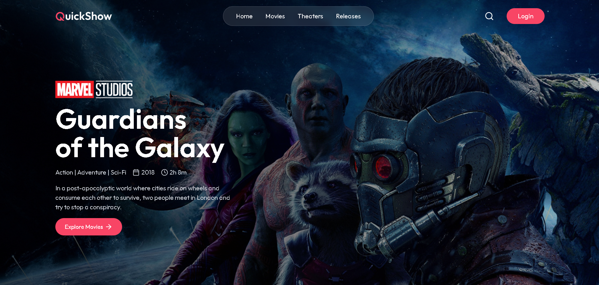
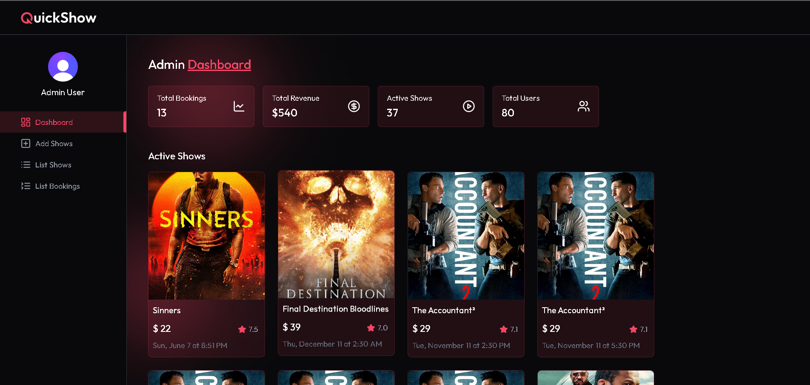

<div align="center">

# QUICKSHOW 🎬🍿🎥

*Seamless Video Discovery. Effortless Entertainment Experience*


**Built with the tools and technologies:**


<br />

## 🎦 LIVE - DEMO 🌐
  
**UI** 👉 [LINK](https://quickshow.vercel.app/)



<br /><hr /><br />

**Admin Dashboard** 👉 [LINK](https://quickshow.vercel.app/admin)



</div>

---

## Table of Contents

- [Overview](#overview)
- [Getting Started](#getting-started)
  - [Prerequisites](#prerequisites)
  - [Installation](#installation)
  - [Usage](#usage)
  - [Testing](#testing)
- [Features](#features)
- [Project Structure](#project-structure)
- [API Documentation](#api-documentation)
- [Configuration](#configuration)
- [Contributing](#contributing)
- [License](#license)

---

## Overview

**QuickShow** is a modern, full-stack movie ticket booking application built with the MERN stack. It provides users with a seamless experience to discover movies, book tickets, and manage their bookings while offering administrators powerful tools to manage shows, bookings, and movie listings.

### Key Highlights

- 🎬 **Movie Discovery**: Browse and search through extensive movie catalogs
- 🎟️ **Ticket Booking**: Interactive seat selection and booking system
- 💳 **Secure Payments**: Integrated Stripe payment processing
- 📱 **Responsive Design**: Mobile-first design approach
- 🔐 **User Authentication**: Secure login and registration system
- 👨‍💼 **Admin Dashboard**: Comprehensive admin panel for management
- ⚡ **Fast Performance**: Built with Vite for lightning-fast development and production builds

---

## Getting Started

### Prerequisites

Before running this application, make sure you have the following installed:

- **Node.js** (v16 or higher)
- **npm** or **yarn**
- **MongoDB** (local or cloud instance)
- **Git**

### Installation

1. **Clone the repository**
   ```console
   git clone https://github.com/yashG72/QuickShowV2
   cd QuickShow
   ```

2. **Install server dependencies**
   ```console
   cd server
   npm install
   ```

3. **Install client dependencies**
   ```console
   cd ../client
   npm install
   ```

4. **Environment Configuration**
   
   Create `.env` files in both `server` and `client` directories:
   
   **Server (.env)**
   ```env
   # 🌐 Database
   MONGODB_URI=mongodb://localhost:27017/quickshow
    
   # 🔐 Clerk Authentication
   CLERK_PUBLISHABLE_KEY=your-clerk-publishable-key
   CLERK_SECRET_KEY=your-clerk-secret-key
    
   # ⚙️ Inngest Event Scheduling
   INNGEST_EVENT_KEY=your-inngest-event-key
   INNGEST_SIGNING_KEY=your-inngest-signing-key
    
   # 🎬 TMDB API (for movie data)
   TMDB_API_KEY=your-tmdb-api-key
    
   # 💳 Stripe Payment Integration
   STRIPE_PUBLISHABLE_KEY=your-stripe-publishable-key
   STRIPE_SECRET_KEY=your-stripe-secret-key
   STRIPE_WEBHOOK_SECRET=your-stripe-webhook-secret
    
   # 📧 Email Notifications (Nodemailer or similar SMTP setup)
   SENDER_EMAIL=your-sender@example.com
   SMTP_USER=your-smtp-username
   SMTP_PASS=your-smtp-password

   ```
   
   **Client (.env)**
   ```env
   # 💱 Currency Symbol
   VITE_CURRENCY=$

   # 🔐 Clerk Authentication (Public Key for Frontend)
   VITE_CLERK_PUBLISHABLE_KEY=your-clerk-publishable-key

   # 🌐 Base API URL (Proxy to Backend)
   VITE_BASE_URL=http://localhost:3000

   # 🎞️ TMDB Image Base URL
   VITE_TMDB_IMAGE_BASE_URL=https://image.tmdb.org/t/p/original

   ```

### Usage

1. **Start the development servers**
   
   **Terminal 1 - Server**
   ```console
   cd server
   npm run dev
   ```
   
   **Terminal 2 - Client**
   ```console
   cd client
   npm run dev
   ```

2. **Access the application**
   - Frontend: `http://localhost:5173`
   - Backend API: `http://localhost:5000`

3. **Admin Access**
   - Create an admin account through the API or manually in the database
   - Access admin panel at `/admin`

### Testing

```bash
# Run client tests
cd client
npm run test

# Run server tests
cd server
npm run test
```

---

## Features

### User Features
- **Authentication**: Secure user registration and login
- **Movie Browsing**: Search and filter movies by genre, rating, and release date
- **Movie Details**: View comprehensive movie information, trailers, and reviews
- **Seat Selection**: Interactive theater seat map with real-time availability
- **Booking Management**: View and manage personal bookings
- **Favorites**: Save favorite movies for quick access
- **Payment Processing**: Secure checkout with Stripe integration

### Admin Features
- **Dashboard Analytics**: Comprehensive booking and revenue analytics
- **Show Management**: Add, edit, and remove movie shows
- **Booking Overview**: View and manage all user bookings
- **Movie Management**: Add new movies with details and media
- **Theater Management**: Configure theater layouts and seat arrangements

### Technical Features
- **Responsive Design**: Mobile-first approach with Tailwind CSS
- **Real-time Updates**: Live seat availability updates
- **Image Optimization**: Cloudinary integration for media management
- **Background Jobs**: Inngest for handling asynchronous tasks
- **Data Validation**: Comprehensive input validation and sanitization
- **Error Handling**: Robust error handling and user feedback

---

## Project Structure

```groovy
quickshow/
├── client/                    # Frontend React application
│   ├── src/
│   │   ├── components/        # Reusable UI components
│   │   │   ├── admin/         # Admin-specific components
│   │   │   └── ...
│   │   ├── pages/             # Page components
│   │   │   ├── admin/         # Admin pages
│   │   │   └── ...
│   │   ├── context/           # React Context providers
│   │   ├── lib/               # Utility functions
│   │   └── assets/            # Static assets
│   ├── public/                # Public assets
│   └── package.json
├── server/                    # Backend Node.js application
│   ├── controllers/           # Route controllers
│   ├── models/                # MongoDB models
│   ├── routes/                # API routes
│   ├── middleware/            # Custom middleware
│   ├── configs/               # Configuration files
│   ├── inngest/               # Background job handlers
│   └── package.json
└── README.md
```

---

## API Documentation

### Authentication Endpoints
- `POST /api/users/register` - User registration
- `POST /api/users/login` - User login
- `GET /api/users/profile` - Get user profile
- `PUT /api/users/profile` - Update user profile

### Movie & Show Endpoints
- `GET /api/shows` - Get all shows
- `GET /api/shows/:id` - Get show details
- `POST /api/admin/shows` - Create new show (Admin)
- `PUT /api/admin/shows/:id` - Update show (Admin)
- `DELETE /api/admin/shows/:id` - Delete show (Admin)

### Booking Endpoints
- `POST /api/bookings` - Create new booking
- `GET /api/bookings/user` - Get user bookings
- `GET /api/admin/bookings` - Get all bookings (Admin)
- `PUT /api/bookings/:id` - Update booking status

### Payment Endpoints
- `POST /api/bookings/create-payment-intent` - Create Stripe payment intent
- `POST /api/webhooks/stripe` - Handle Stripe webhooks

---

## Configuration

### Environment Variables

| Variable                 | Description                                            | Required |
| ------------------------ | ------------------------------------------------------ | -------- |
| `MONGODB_URI`            | MongoDB connection string                              | ✅        |
| `CLERK_PUBLISHABLE_KEY`  | Clerk frontend (public) key for user authentication    | ✅        |
| `CLERK_SECRET_KEY`       | Clerk backend secret key for server‑side auth          | ✅        |
| `INNGEST_EVENT_KEY`      | Inngest event key for scheduling/triggering jobs       | ✅        |
| `INNGEST_SIGNING_KEY`    | Inngest signing key to verify incoming events          | ✅        |
| `TMDB_API_KEY`           | TMDB API key for fetching movie metadata & posters     | ✅        |
| `STRIPE_PUBLISHABLE_KEY` | Stripe publishable (public) key for frontend payments  | ✅        |
| `STRIPE_SECRET_KEY`      | Stripe secret key for server‑side payment logic        | ✅        |
| `STRIPE_WEBHOOK_SECRET`  | Stripe webhook secret for verifying webhook signatures | ✅        |
| `SENDER_EMAIL`           | “From” email address for transactional emails          | ✅        |
| `SMTP_USER`              | SMTP username (e.g., SendGrid / Mailgun)               | ✅        |
| `SMTP_PASS`              | SMTP password / API token                              | ✅        |

### Deployment

The application is configured for deployment on Vercel with the included `vercel.json` files.

**Deploy to Vercel:**
```console
# Install Vercel CLI
npm i -g vercel

# Deploy
vercel --prod
```

---

## Contributing

1. Fork the repository
2. Create a feature branch (`git checkout -b feature/amazing-feature`)
3. Commit your changes (`git commit -m 'Add some amazing feature'`)
4. Push to the branch (`git push origin feature/amazing-feature`)
5. Open a Pull Request

### Development Guidelines

- Follow the existing code style and conventions
- Write meaningful commit messages
- Add tests for new features
- Update documentation as needed
- Ensure all tests pass before submitting PR

---


---


---


---

<div align="center">

**Made with ❤️ by Yash Goyal**

[⬆ Back to Top](#table-of-contents)

</div>

